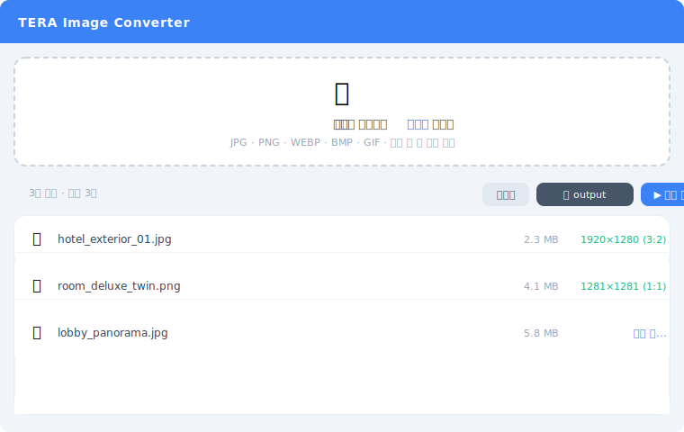

# TERA Image Converter

Automatically crops and resizes images to match TERA's specifications.

**-> [https://geresia.github.io/TVLK_TERA_IMG_CONVERTER/](https://geresia.github.io/TVLK_TERA_IMG_CONVERTER/)**

---

## Features

- Drag & drop or click to add images
- **Auto center-crop** to the nearest TERA-compliant ratio
  - Ratios: `1:1` / `3:2` / `16:9`
  - Size range: `800×600` min - `4096×4096` max
  - Width ≤ 1280px is automatically upscaled to 1281px
- Saves as JPEG at 0.92 quality
- **Batch processing** support
- Output saved directly to a folder you choose

## Usage

1. Open the [link](https://geresia.github.io/TVLK_TERA_IMG_CONVERTER/) (Chrome / Edge recommended)
2. Click **Select Output Folder** to choose where files are saved
3. Add images by dragging or clicking
4. Click **▶ Convert**

> Safari / Firefox do not support the File System Access API required for saving files.

## Supported Formats

`JPG` · `PNG` · `WEBP` · `BMP` · `GIF`

## Tech Stack

- React 18 + TypeScript + Vite
- Tailwind CSS v4
- Canvas API (image processing)
- File System Access API (file saving)
- GitHub Pages (deployment)
